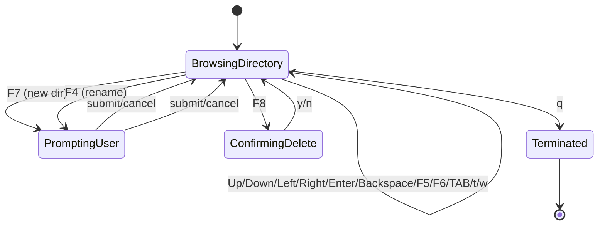
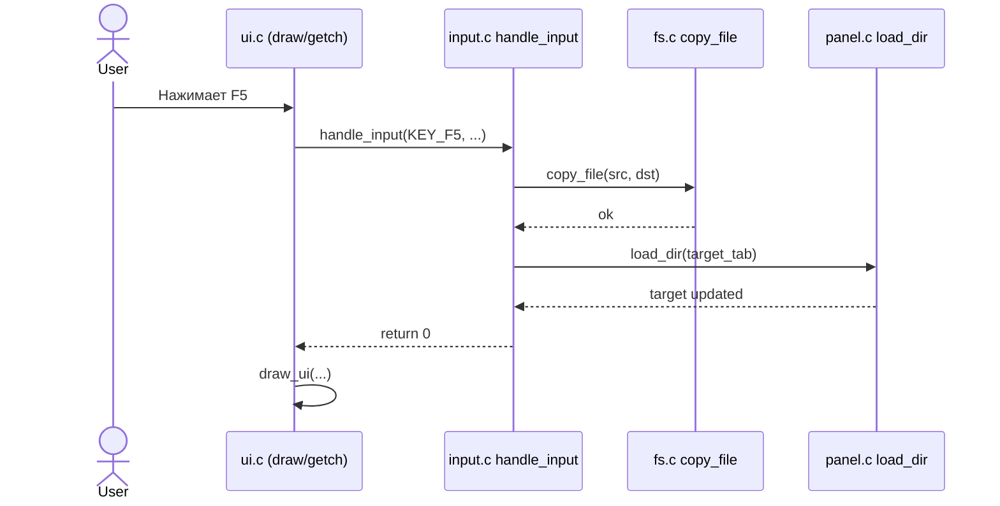

```mermaid
flowchart TD
    A[Start handle_input(ch,l,r,active)] --> B[Определить active panel p и other panel]
    B --> C[Получить активные Tab: t и to]
    C --> D{switch(ch)}

    D -->|q| E[return 1]
    D -->|TAB| F[Переключить active]
    D -->|KEY_UP/KEY_DOWN| G[Сдвинуть cursor/scroll]
    D -->|Enter| H[enter_dir(t)]
    D -->|Backspace| I[up_dir(t)]
    D -->|F5| J[copy_file(src,dst); load_dir(to)]
    D -->|F6| K[move_file(src,dst); load_dir(t,to)]
    D -->|F7| L[ui_prompt -> make_dir -> load_dir(t)]
    D -->|F8| M[ui_confirm -> delete_file -> load_dir(t)]
    D -->|F4| N[ui_prompt -> move_file(rename) -> load_dir(t)]
    D -->|t/w| O[new_tab/close_tab]
    D -->|LEFT/RIGHT| P[Сменить active_tab]

    F --> Q[return 0]
    G --> Q
    H --> Q
    I --> Q
    J --> Q
    K --> Q
    L --> Q
    M --> Q
    N --> Q
    O --> Q
    P --> Q
```

## 3.2 Функциональная схема: `load_dir`
```mermaid
flowchart TD
    A[Start load_dir(t)] --> B[opendir(t.path)]
    B -->|ошибка| Z[return]
    B -->|ok| C[t.count = 0]
    C --> D{readdir && count < MAX_FILES}
    D -->|yes| E[Заполнить f->name, selected]
    E --> F[join_path(full, t.path, f.name)]
    F --> G{lstat(full) ok?}
    G -->|yes| H[Заполнить is_dir/is_link/size/mode/mtime]
    G -->|no| I[Поставить поля в 0]
    H --> J[count++]
    I --> J
    J --> D
    D -->|no| K[Нормализовать cursor]
    K --> L[sort_tab(t)]
    L --> M[closedir]
    M --> N[return]
```

## 3.3 Диаграмма состояний


## 3.4 Диаграмма взаимодействий (пример: F5 copy)

