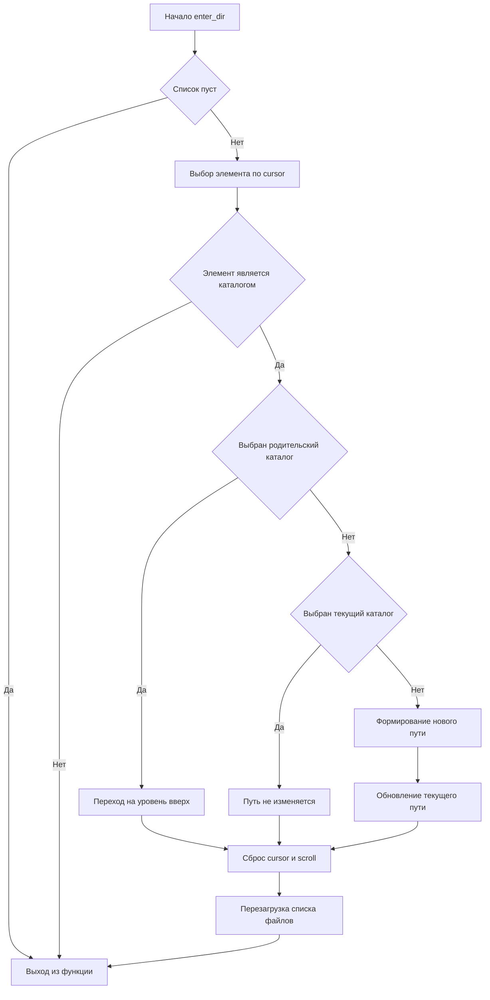
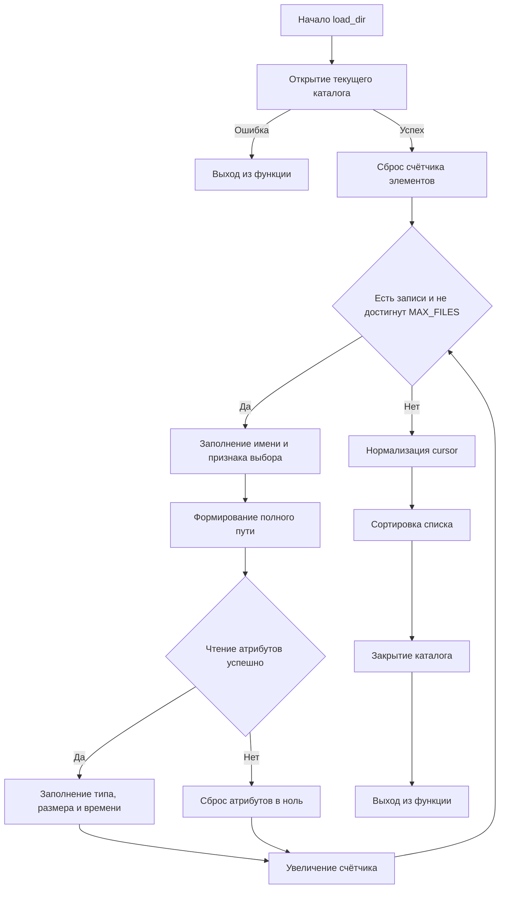
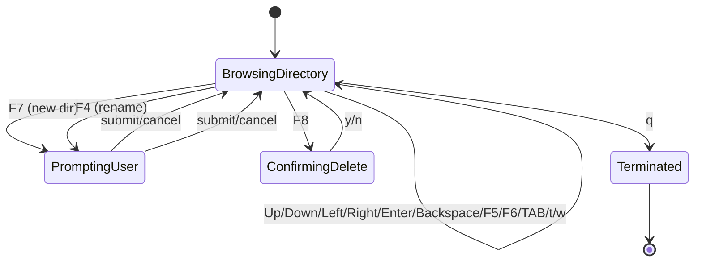
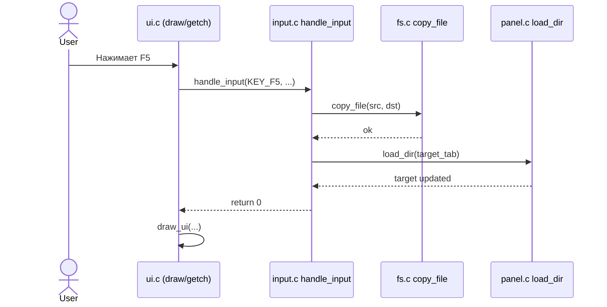

```mermaid
flowchart TD
    A[Начало enter_dir] --> B{Список пуст}
    B -->|Да| Z[Выход из функции]
    B -->|Нет| C[Выбор элемента по cursor]
    C --> D{Элемент является каталогом}
    D -->|Нет| Z
    D -->|Да| E{Выбран родительский каталог}
    E -->|Да| F[Переход на уровень вверх]
    E -->|Нет| G{Выбран текущий каталог}
    G -->|Да| H[Путь не изменяется]
    G -->|Нет| I[Формирование нового пути]
    I --> J[Обновление текущего пути]
    H --> K[Сброс cursor и scroll]
    F --> K
    J --> K
    K --> L[Перезагрузка списка файлов]
    L --> Z
```

## 3.2 Функциональная схема: `load_dir`

```mermaid
flowchart TD
    A[Начало load_dir] --> B[Открытие текущего каталога]
    B -->|Ошибка| Z[Выход из функции]
    B -->|Успех| C[Сброс счётчика элементов]
    C --> D{Есть записи и не достигнут MAX_FILES}
    D -->|Да| E[Заполнение имени и признака выбора]
    E --> F[Формирование полного пути]
    F --> G{Чтение атрибутов успешно}
    G -->|Да| H[Заполнение типа, размера и времени]
    G -->|Нет| I[Сброс атрибутов в ноль]
    H --> J[Увеличение счётчика]
    I --> J
    J --> D
    D -->|Нет| K[Нормализация cursor]
    K --> L[Сортировка списка]
    L --> M[Закрытие каталога]
    M --> N[Выход из функции]
```

## 3.3 Диаграмма состояний

```mermaid
stateDiagram-v2
    [*] --> BrowsingDirectory

    BrowsingDirectory --> PromptingUser: F7 (new dir)
    PromptingUser --> BrowsingDirectory: submit/cancel

    BrowsingDirectory --> PromptingUser: F4 (rename)
    PromptingUser --> BrowsingDirectory: submit/cancel

    BrowsingDirectory --> ConfirmingDelete: F8
    ConfirmingDelete --> BrowsingDirectory: y/n

    BrowsingDirectory --> BrowsingDirectory: Up/Down/Left/Right/Enter/Backspace/F5/F6/TAB/t/w
    BrowsingDirectory --> Terminated: q
    Terminated --> [*]
```

## 3.4 Диаграмма взаимодействий (пример: F5 copy)

```mermaid
sequenceDiagram
    actor User
    participant UI as ui.c (draw/getch)
    participant IN as input.c handle_input
    participant FS as fs.c copy_file
    participant PN as panel.c load_dir

    User->>UI: Нажимает F5
    UI->>IN: handle_input(KEY_F5, ...)
    IN->>FS: copy_file(src, dst)
    FS-->>IN: ok
    IN->>PN: load_dir(target_tab)
    PN-->>IN: target updated
    IN-->>UI: return 0
    UI->>UI: draw_ui(...)
```
